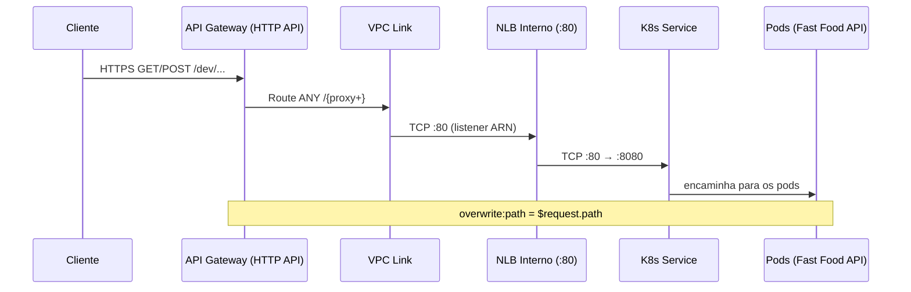

# 4-API-Gateway — HTTP API + VPC Link (Privado)

Esta camada provisiona um Amazon API Gateway HTTP API com integração privada (VPC Link) para o backend em EKS por trás de um Network Load Balancer (NLB) interno. Inclui CORS, logging no CloudWatch e variáveis utilitárias para simplificar a configuração.

## Visão Geral

```mermaid
flowchart LR
    C[Cliente/Internet]
    AG[API Gateway (HTTP API)\nStage: dev\nCORS + Logs (CloudWatch)]
    VPC[API Gateway VPC Link]
    NLB[NLB Interno (:80)]
    SVC[K8s Service (LoadBalancer)]
    POD[Pods - Fast Food API (Gin)]
    RDS[(RDS MySQL Externo)]

    C -->|HTTPS| AG
    AG -->|Privado| VPC
    VPC --> NLB
    NLB --> SVC
    SVC --> POD
    POD --- RDS
```

## Recursos Criados

- `aws_apigatewayv2_api.main`: HTTP API (nome: `soat-fast-food-api`)
- `aws_apigatewayv2_stage.main`: Stage `dev` (auto_deploy=true)
- `aws_cloudwatch_log_group.api_gateway`: Log group `/aws/apigateway/soat-fast-food-api`
- `aws_security_group.vpc_link`: SG para o VPC Link
- `aws_apigatewayv2_vpc_link.main`: VPC Link nas subnets privadas
- `aws_apigatewayv2_integration.backend`: Integração HTTP_PROXY via VPC Link para o listener do NLB
  - `integration_uri = <ARN do listener do NLB>`
  - `request_parameters = { "overwrite:path" = "$request.path" }`
- `aws_apigatewayv2_route.proxy`: Rota `ANY /{proxy+}` apontando para a integração

## Pré‑requisitos

- Camada `0-bootstrap` aplicada (state remoto S3)
- Camada `1-networking` aplicada (VPC + subnets privadas/públicas, tags para ELB)
- Camada `2-eks` aplicada (nodes em subnets privadas)
- Backend deployado via Helm com Service expondo NLB interno:
  - Arquivo: `soat_tech_challenge_fast_food_infra/helm/fast-food/templates/service.yaml`
  - Annotations principais:
    - `service.beta.kubernetes.io/aws-load-balancer-type: "nlb"`
    - `service.beta.kubernetes.io/aws-load-balancer-internal: "true"`
    - `service.beta.kubernetes.io/aws-load-balancer-nlb-target-type: "ip"`

## Como Implantar

1) Criar/atualizar o Service (NLB interno):

```
helm upgrade --install fast-food \
  ./soat_tech_challenge_fast_food_infra/helm/fast-food \
  -n fast-food -f soat_tech_challenge_fast_food_infra/helm/fast-food/values.yaml --wait

kubectl -n fast-food get svc fast-food -o jsonpath='{.status.loadBalancer.ingress[0].hostname}{"\n"}'
# Ex.: ad51ed2ea764549dc8a78495dfb5e978-e9f7d118e893f2e6.elb.us-east-1.amazonaws.com (scheme internal)
```

2) Aplicar Terraform do API Gateway (informando o nome do NLB):

```
cd soat_tech_challenge_fast_food_infra/4-api-gateway
terraform init
terraform apply -var="nlb_name=<NOME_DO_NLB>"
# Dica: o nome do NLB é o prefixo do DNS (antes do primeiro hífen)
# Ex.: DNS=ad51ed2ea764549dc8a78495dfb5e978-...  → nlb_name=ad51ed2ea764549dc8a78495dfb5e978
```

3) Testar a API via Gateway:

```
API_URL=$(terraform output -raw stage_invoke_url)
curl -i "$API_URL/health"            # deve retornar 200 com JSON {status: ok}
curl -i "$API_URL/api/v1/products"   # conforme rotas do backend
```

## Variáveis Principais (Terraform)

- `nlb_name` (string): nome do NLB interno criado pelo Service. Default: `fast-food-nlb` (use `-var` para sobrepor)
- `backend_listener_port` (number): porta do listener do NLB. Default: `80`
- `route_key` (string): rota ligada à integração. Default: `ANY /{proxy+}`
- Outras variáveis: `api_name`, `stage_name`, `cors_*`, `log_retention_days`, etc.

## Como Funciona o Roteamento



- O parâmetro `request_parameters = { "overwrite:path" = "$request.path" }` garante que o caminho completo requisitado pelo cliente (ex.: `/health`, `/api/v1/orders`) seja encaminhado ao backend.
- Sem isso, a chamada pode cair em `/` no backend e retornar 404.

## TLS (opcional)

- Para tráfego cifrado até o NLB:
  - Adicione listener 443 no NLB via annotations do Service (ACM/TLS)
  - Ajuste `backend_listener_port = 443`
  - Configure `tls_config.server_name_to_verify` na integração do API Gateway (igual ao hostname do certificado do NLB)
- Como o NLB aqui é interno e o tráfego fica dentro da VPC, HTTP pode ser aceitável para ambientes não regulados.

## Observações sobre o NLB

- O in-tree cloud provider do Kubernetes pode ignorar nomes de LB; por isso usamos `nlb_name` dinâmico (descoberto a partir do DNS gerado).
- Se você utilizar o AWS Load Balancer Controller, pode usar `spec.loadBalancerClass: service.k8s.aws/nlb` e obter mais controle (nomenclatura, target-type IP, etc.).

## Troubleshooting

- 404 no `/health` via API Gateway:
  - Confirme que a integração tem `request_parameters.overwrite:path = "$request.path"`.
  - Verifique a rota `ANY /{proxy+}` no API Gateway.

- NLB público em vez de interno:
  - Garanta as annotations do Service e recrie o Service (mudar apenas a annotation não altera o scheme do LB existente).
  - O DNS de LBs internos normalmente aparece como `internal-…` (ou verifique `Scheme=internal` via AWS CLI).

- 502/504 via API Gateway:
  - Verifique health checks do NLB, pods prontos, e security groups.
  - Confirme que o listener/porta do NLB coincide com `backend_listener_port`.

- Erro ao mapear headers restritos:
  - HTTP API bloqueia operações sobre certos cabeçalhos (`x-forwarded-for`, etc.). Mantenha apenas `overwrite:path`.

## Custos

- API Gateway (HTTP API): por requisições
- CloudWatch Logs: armazenamento/ingestão
- VPC Link: ~$0.01/h + transferência

## Destruir

```
cd soat_tech_challenge_fast_food_infra/4-api-gateway
terraform destroy
```
