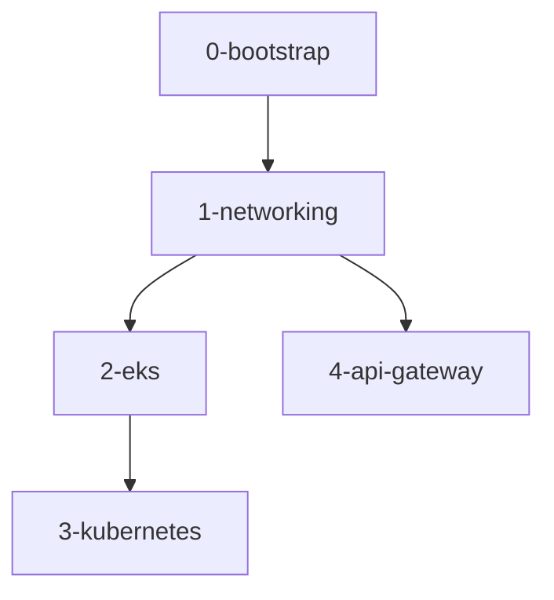

# 🏗️ Infraestrutura Terraform - Tech Challenge Fast Food

## 📋 Visão Geral

Este repositório contém a infraestrutura como código (IaC) do projeto Tech Challenge Fast Food, organizada em camadas independentes com states isolados para melhor performance, manutenção e escalabilidade.

## 🎯 Arquitetura

A infraestrutura está dividida em **5 camadas independentes**:

```
terraform/
├── 0-bootstrap/          # S3 bucket para states
├── 1-networking/         # VPC, subnets, gateways
├── 2-eks/               # Cluster EKS e nodes
├── 3-kubernetes/        # Helm charts e add-ons
├── 4-api-gateway/       # API Gateway HTTP
├── scripts/             # Scripts de automação
└── docs/                # Documentação detalhada
```

## 🚀 Quick Start

### Pré-requisitos

- **Terraform**: ~> 1.13.2
- **AWS CLI**: Configurado com perfil `default` (execução local do terraform)
- **AWS Role**: Configurado com a role `soat-tech-challenge-fast-food-role` (execução via actions do terraform)
```json
{
    "Path": "/",
    "RoleName": "soat-tech-challenge-fast-food-role",
    "RoleId": "AROAUWX4ZSPFOKAB37J5H",
    "Arn": "arn:aws:iam::323726447562:role/soat-tech-challenge-fast-food-role",
    "CreateDate": "2025-10-07T00:25:19+00:00",
    "AssumeRolePolicyDocument": {
        "Version": "2012-10-17",
        "Statement": [
            {
                "Sid": "Administrator",
                "Effect": "Allow",
                "Principal": {
                    "AWS": "arn:aws:iam::323726447562:user/terraform"
                },
                "Action": "sts:AssumeRole"
            }
        ]
    },
    "Description": "",
    "MaxSessionDuration": 3600
}
```
- **kubectl**: Para gerenciar Kubernetes
- **Permissões AWS**: Adequadas para criar recursos

### Deploy Rápido

```bash
# 1. Validar configurações
./terraform/scripts/validate-all.sh

# 2. Deploy completo (25-30 minutos)
./terraform/scripts/deploy-all.sh

# 3. Verificar deployment
kubectl get nodes
kubectl get pods -A
```

### Destruir Infraestrutura

```bash
# Destruir tudo (requer confirmação)
./terraform/scripts/destroy-all.sh
```

## 📊 Camadas Detalhadas

### 0-Bootstrap
**Propósito**: Bucket S3 para armazenar Terraform states

**Recursos**:
- S3 Bucket com versionamento
- Criptografia AES256
- Lifecycle policy (90 dias)

**Documentação**: [`0-bootstrap/README.md`](0-bootstrap/README.md)

---

### 1-Networking
**Propósito**: Infraestrutura de rede base

**Recursos**:
- VPC (10.0.0.0/16)
- 2 Subnets públicas (Multi-AZ)
- 2 Subnets privadas (Multi-AZ)
- Internet Gateway + NAT Gateway
- Route Tables

**Documentação**: [`1-networking/README.md`](1-networking/README.md)

---

### 2-EKS
**Propósito**: Cluster Kubernetes gerenciado

**Recursos**:
- EKS Cluster (v1.29)
- Node Group (t3.medium, 1-2 nodes)
- IAM Roles e Policies
- Pod Identity Addon

**Documentação**: [`2-eks/README.md`](2-eks/README.md)

---

### 3-Kubernetes
**Propósito**: Add-ons e componentes Kubernetes

**Recursos**:
- Metrics Server (Helm)
- Cluster Autoscaler (Helm)
- IAM Roles para service accounts

**Documentação**: [`3-kubernetes/README.md`](3-kubernetes/README.md)

---

### 4-API-Gateway
**Propósito**: Exposição de APIs

**Recursos**:
- API Gateway HTTP API
- CloudWatch Logs
- CORS configurado
- Preparado para VPC Link

**Documentação**: [`4-api-gateway/README.md`](4-api-gateway/README.md)

## 🔄 Fluxo de Dependências



## 📚 Documentação

### Guias Principais

- **[DEPLOYMENT.md](docs/DEPLOYMENT.md)**: Guia completo de deployment
- **[ARCHITECTURE.md](docs/ARCHITECTURE.md)**: Arquitetura detalhada
- **[Scripts README](scripts/README.md)**: Documentação dos scripts

### READMEs por Camada

Cada camada possui seu próprio README com:
- Recursos criados
- Variáveis disponíveis
- Outputs exportados
- Instruções de uso
- Troubleshooting

## 🛠️ Scripts Disponíveis

### deploy-all.sh
Deploy completo de todas as camadas

```bash
./terraform/scripts/deploy-all.sh
```

### destroy-all.sh
Destruição completa (ordem reversa)

```bash
./terraform/scripts/destroy-all.sh
```

### validate-all.sh
Validação de todas as configurações

```bash
./terraform/scripts/validate-all.sh
```


## 🔍 Monitoramento

### Métricas Disponíveis
- CPU/Memory dos nodes
- Métricas de pods
- API Gateway logs
- CloudWatch integration

### Comandos Úteis

```bash
# Métricas de nodes
kubectl top nodes

# Métricas de pods
kubectl top pods -A

# Logs do Cluster Autoscaler
kubectl logs -n kube-system -l app.kubernetes.io/name=aws-cluster-autoscaler

# API Gateway URL
cd terraform/4-api-gateway
terraform output stage_invoke_url
```
