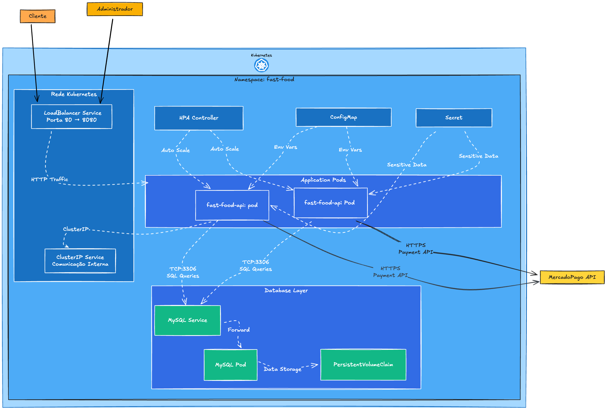
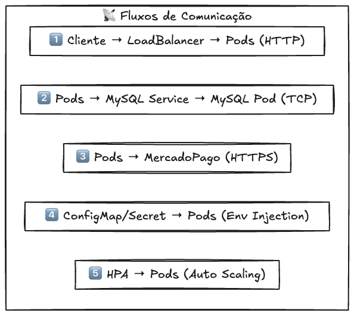

# Tech Challenge - Sistema de Autoatendimento para Lanchonete

Este projeto é parte do **Tech Challenge - Fase 02**, implementando um sistema completo de controle de pedidos para lanchonete com arquitetura Clean Code, Clean Architecture e infraestrutura Kubernetes.

## 📋 Índice

- [Visão Geral](#-visão-geral)
- [Arquitetura do Sistema](#-arquitetura-do-sistema)
- [Infraestrutura Kubernetes](#-infraestrutura-kubernetes)
- [Configuração](#️-configuração)
- [Deploy](#-github-actions)

## 🎯 Visão Geral

Este projeto implementa um sistema completo de autoatendimento para lanchonetes seguindo os padrões **Clean Code** e **Clean Architecture**, com infraestrutura **Kubernetes** para alta disponibilidade e escalabilidade.

## 🏗️ Arquitetura do Sistema

### Diagrama da Infraestrutura Kubernetes
O sistema utiliza **Clean Architecture** com infraestrutura **Kubernetes** gerenciada por **Helm**:





### Como a Aplicação se Comunica com o Banco?
1. **Pods da Aplicação** fazem conexões TCP na porta 3306
2. **MySQL Service** (`fast-food-api-mysql`) roteia para o **MySQL Pod**
3. **Configurações** injetadas via **ConfigMap** (host, porta, database) e **Secret** (senha)
4. **Dados persistidos** no **PVC** (10Gi) para sobreviver a restarts

### Como os Componentes Kubernetes se Comunicam?
1. **LoadBalancer** recebe tráfego externo e distribui para os pods
2. **ClusterIP Services** permitem comunicação interna entre pods
3. **HPA** monitora métricas e escala pods automaticamente
4. **ConfigMaps/Secrets** injetam configurações nos pods via variáveis de ambiente
5. **DNS interno** do cluster resolve nomes de services automaticamente


## ⚙️ Configuração

### Pré-requisitos

- **Git** - Para clonar o repositório

## ☸️ Pipeline de Deploy utilizando Github Actions

1. Clone o repositório:
```bash
git clone https://github.com/samuellalvs/soat_tech_challenge_fast_food_infra.git
cd soat_tech_challenge_fast_food_infra
```
2. A criação de uma Pull Request para branch mais inicia execução do pipeline:
- Pull Request aberta executa o terraform plan;
- O merge da Pull Request executa o terraforma apply.
